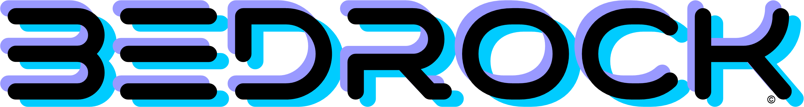

<p align="center">
  
</p>

<h3 align="center">Identity-based security framework</h3>

<p align="center">
  Every node is a user. Everything between is encrypted at rest.
</p>

<p align="center">
  <a href="https://github.com/drc10101/bedrock/releases/tag/v0.3.0"></a>
  
  
  
  
</p>

---

Bedrock provides the foundational security layer for applications that handle sensitive data — healthcare, finance, defense, and beyond. It enforces identity at every endpoint, encrypts all data at rest, and gates every cross-silo access through cryptographic consent.

## Core Principles

- **Every node is a user.** Each compute endpoint has a cryptographic identity.
- **Encrypted at rest, always.** Data exists in cleartext only at the consuming endpoint, only for the minimum time required.
- **Consent-gated access.** No cross-silo data access without cryptographic proof of consent.
- **Audit everything.** SHA-256 hash chain — tamper-evident, tamper-resistant.
- **Self-hosted first.** No Bedrock-operated infrastructure required.

## Quick Start

```bash
# Install
pip install bedrock-core

# Initialize a project
bedrock init ./my-project
cd my-project

# Generate a free 30-day trial license
bedrock trial --licensee "your-email@example.com"

# Start the API server
bedrock serve
```

### From Source

```bash
git clone https://github.com/drc10101/bedrock.git
cd bedrock/core
pip install -e ".[dev]"
pytest

# Or with Docker
docker compose -f deploy/docker-compose.yml up
```

## CLI Commands

| Command | Description |
|---------|-------------|
| `bedrock init [dir]` | Initialize a new project (config, keys, env template) |
| `bedrock trial [--licensee]` | Generate a free 30-day trial license |
| `bedrock serve [--host] [--port]` | Start the API server |
| `bedrock keygen [--key-id]` | Generate a signing key |
| `bedrock license issue --tier --licensee` | Issue a license key |
| `bedrock license validate --key` | Validate a license key |
| `bedrock license revoke --key-id` | Revoke a signing key |
| `bedrock health [--json]` | Run health checks |
| `bedrock status` | Show system status and config |

## Architecture

```
┌─────────────────────────────────────────────────────┐
│                    Application                       │
├──────────┬──────────┬──────────┬────────────────────┤
│  Python  │TypeScript│   CLI    │     REST API       │
│   SDK    │   SDK    │ bedrock  │  (FastAPI/uvicorn) │
├──────────┴──────────┴──────────┴────────────────────┤
│                  Bedrock Core                        │
├──────────┬──────────┬──────────┬──────────┬─────────┤
│Encryption│  Identity │   Data   │  Access  │  Audit  │
│  Engine  │  Fabric   │ Silos    │ Control  │  Chain  │
├──────────┴──────────┴──────────┴──────────┴─────────┤
│              Key Management (HKDF)                   │
├─────────────────────────────────────────────────────┤
│           Self-Healing Mesh Transport                │
└─────────────────────────────────────────────────────┘
```

## Licensing

Bedrock is source-available under the [Business Source License 1.1](LICENSE).

### Free Trial

Start with a free 30-day trial — full developer features, 3 local nodes, self-signed certificates. No credit card required.

```bash
bedrock trial --licensee "your-email@example.com"
```

### Pricing

| Tier | Price | Nodes | Certificates | Use Case |
|------|-------|-------|---------------|----------|
| **Trial** | Free (30 days) | 3 | Self-signed | Evaluation and development |
| **Developer** | $99/yr | 3 | Self-signed | Individual development |
| **Professional** | $499/yr | 10 | Self-signed | Team development |
| **Starter** | $5K/yr | 5 | CA-enforced | Production deployment |
| **Business** | $20K/yr | 25 | CA-enforced | Production at scale |
| **Enterprise** | Custom | Unlimited | CA-enforced | Mission-critical deployments |

**Non-production use** (development, testing, evaluation) is free forever under BSL-1.1. **Production deployment** requires a paid license.

### How It Works

1. `bedrock trial` — get a free 30-day license with full developer features
2. Evaluate Bedrock locally — self-signed certs, 3 nodes, all APIs
3. When ready for production, purchase a runtime license at [bedrock.dev/pricing](https://bedrock.dev/pricing)
4. Upgrade your license key — no code changes, no reinstallation

## SDKs

### Python

```python
from bedrock_sdk import BedrockClient

client = BedrockClient(
    base_url="https://bedrock.example.com",
    license_key="1:...",
)

# Register a node
node = client.nodes.register(name="my-service", node_type="application")

# Create a data silo
silo = client.silos.create(
    name="patient-records",
    display_name="Patient Records",
    categories=["medical", "phi"],
)

# Encrypt a field
ciphertext = client.encryption.encrypt(
    plaintext="SSN-123-45-6789",
    silo=silo.silo_id,
    record_id="patient-001",
    scope="ssn",
    operation="store",
)

# Request consent for cross-silo access
consent = client.consent.request(
    requester_id=node.node_id,
    target_id="patient-001",
    silo_id=silo.silo_id,
    purpose="treatment",
    scope=["ssn", "diagnosis"],
)
```

### TypeScript

```typescript
import { BedrockClient } from "@infill/bedrock-sdk";

const client = new BedrockClient({
  baseUrl: "https://bedrock.example.com",
  licenseKey: "1:...",
});

// Same API surface as Python SDK
const node = await client.nodes.register({ name: "my-service" });
const silo = await client.silos.create({ name: "patient-records" });
```

## Testing

```bash
# Core tests
cd core && pytest

# Python SDK tests
cd sdk-python && pytest

# TypeScript SDK tests
cd sdk-ts && npm test
```

All 930 tests pass: 788 core + 20 Python SDK + 122 TypeScript SDK.

## Security

See [SECURITY.md](SECURITY.md) for reporting vulnerabilities.

**Do not report security issues through public GitHub issues.**

## License

This software is licensed under the [Business Source License 1.1](LICENSE). 

You may use, modify, and redistribute this software for non-production purposes (development, testing, evaluation) free of charge. Production use requires a paid license — see [bedrock.dev/pricing](https://bedrock.dev/pricing).

The BSL converts to an open-source license (typically Apache 2.0) on a predetermined change date — see the LICENSE file for details.